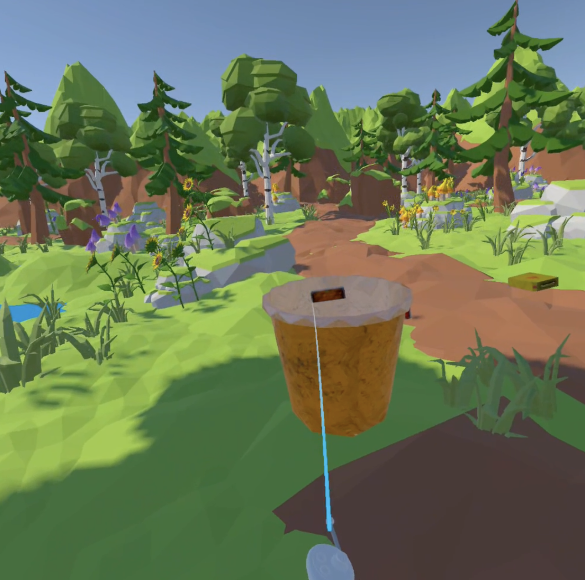

# 🌿 Eco-Explorer: Experiencia de Bosque Virtual

**Autor:** Eric Sebastiaan Rudischhauser  
**Dispositivo:** Meta Quest Pro  
**Motor de desarrollo:** Unity 2022.3 LTS

---

## 🧭 Descripción del Proyecto

**Eco-Explorer: Experiencia de Bosque Virtual** es una aplicación de **realidad mixta** desarrollada en Unity para el visor **Meta Quest Pro**.  
El proyecto busca fomentar la conciencia ambiental a través de una experiencia inmersiva en un **bosque virtual**, donde el usuario puede moverse libremente, interactuar con elementos naturales y participar en **misiones ecológicas gamificadas**.

### 🎮 Características principales

-   Entorno 3D de bosque natural, optimizado para Meta Quest Pro.
-   Locomoción libre del jugador mediante **XR Interaction Toolkit**.
-   Misiones ecológicas:
    1. Recolectar basura ♻️
    2. Sembrar un árbol 🌱
    3. Observar fauna local 🐦
-   Interfaz sencilla con retroalimentación visual y sonora.
-   Enfoque educativo y sostenible.

---

## ⚙️ Tecnologías Utilizadas

-   **Unity 2022.3 LTS**
-   **C# (Unity Scripting)**
-   **XR Interaction Toolkit**
-   **OpenXR Plugin (Meta Quest Pro)**
-   **Universal Render Pipeline (URP)**
-   **Asset Store** para el entorno forestal
-   **Audios ambientales y efectos** (fuentes libres)

---

## 🧩 Pre-requisitos

Antes de ejecutar o modificar el proyecto, asegúrate de tener instaladas las siguientes herramientas:

-   **Unity Hub** (versión más reciente)
-   **Unity 2022.3 LTS** con los módulos:
    -   Android Build Support
    -   Android SDK & NDK Tools
    -   OpenJDK
-   **Meta Quest Developer Hub** (opcional para pruebas)
-   **Meta Quest Pro** en **modo desarrollador**

---

## 🖼️ Imagen Representativa

---

## 💾 Instrucciones de Descarga y Configuración del Código

1. Clonar el repositorio:  
   git clone https://github.com/Ericode99/proyetoFinalTourismo
